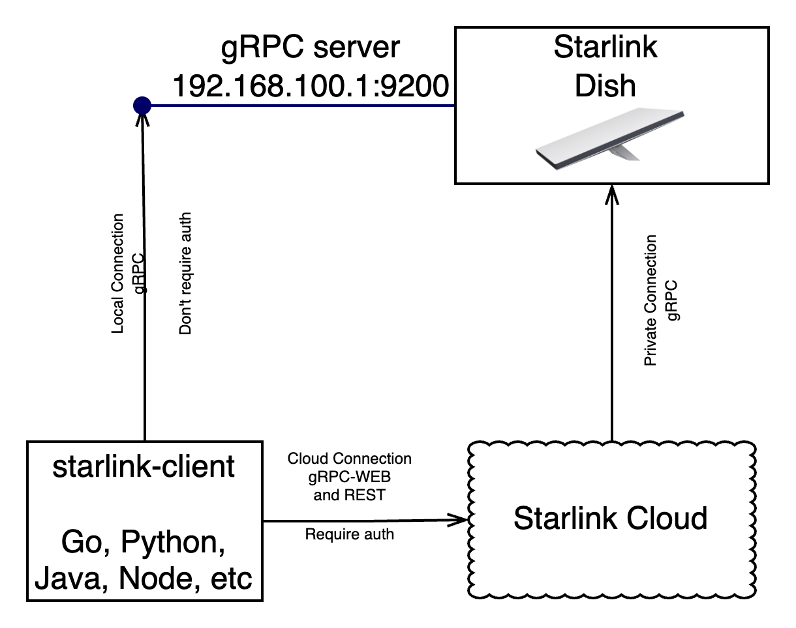

# Starlink Client Library Documentation

## Description

This library allows you to connect to the Starlink system in two ways:
- **Directly to Starlink on the local network**: This option is available if Starlink is accessible within the local network. No authentication is required to perform operations in this case.
- **Remotely via the Starlink API**: This requires authentication, and communication is done through gRPC-Web and REST.

Note: The starlink dish run a gRPC server on port 9200, but it is not exposed to the internet.


The .proto files were obtained from the antenna itself, using grpc-curl.

If you have an antenna and want to update the protos you can run
```bash
make extract_protos
```

To compile the prototypes to specific languages, connect was used

```bash
make generate
```

See: https://connectrpc.com/


## Supported Operations

- **Get Account Data**: Retrieve account information such as email, customer name, etc.
- **Get Device Location**: Obtain the location of the device. For precise real-time location, you need to be on the local network. Otherwise, you can get the H3 cell where the antenna is connected.
- **Get Network Stats**: Retrieve network statistics such as latency and current download speed.
- **Reboot the Dish**: Remotely reboot the Starlink dish.
- **Telemetry**: Retrieve telemetry data from the dish and router, including errors, warnings, etc.
- **Set Dish Config**: Set the dish configuration, such as snow melt mode, power saving mode, etc.
- **Get WiFi Status**: Get information about connected clients, SSID, etc.
- **Change WiFi Configuration**: Modify the SSID name, hide SSID, change passwords, enable bypass mode, etc.

You can use the predefined methods provided by the library for these operations or make direct calls using the `call` method with the Request and Response messages defined in the "proto" directory.

## Authentication
To extract the cookie from the browser, you need to log in from any browser and manually copy the cookie.

The cookie lasts for 15 days, but the library supports cookie refresh, which allows for longer use if the cookie is refreshed regularly. Simply use the library within 15 days, and it will save the refreshed cookie in a directory.

Note that some calls can be made via Stream instead of gRPC unary calls.


## Supported Client Libraries

The following languages are supported for client libraries:

- [x] [GO](libs/golang/client/README.md)
- [x] [Python](libs/python/starlink-client/README.md)
- [ ] Javascript
- [ ] Dart
- [ ] Java
- [ ] Kotlin
- [ ] Swift


### Legal

This project is not affiliated with SpaceX or Starlink. It is an independent project created by a fan of the service.